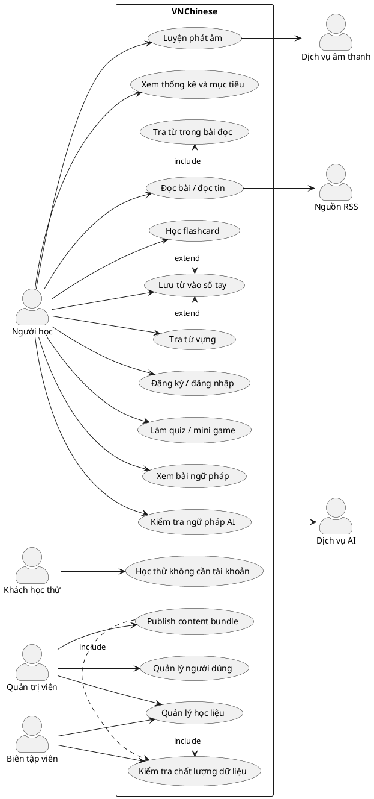
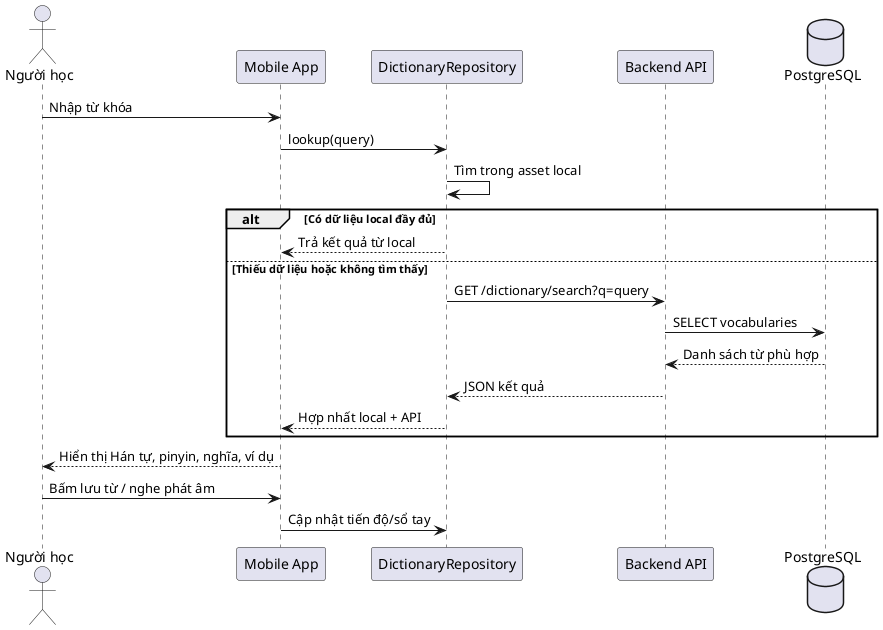
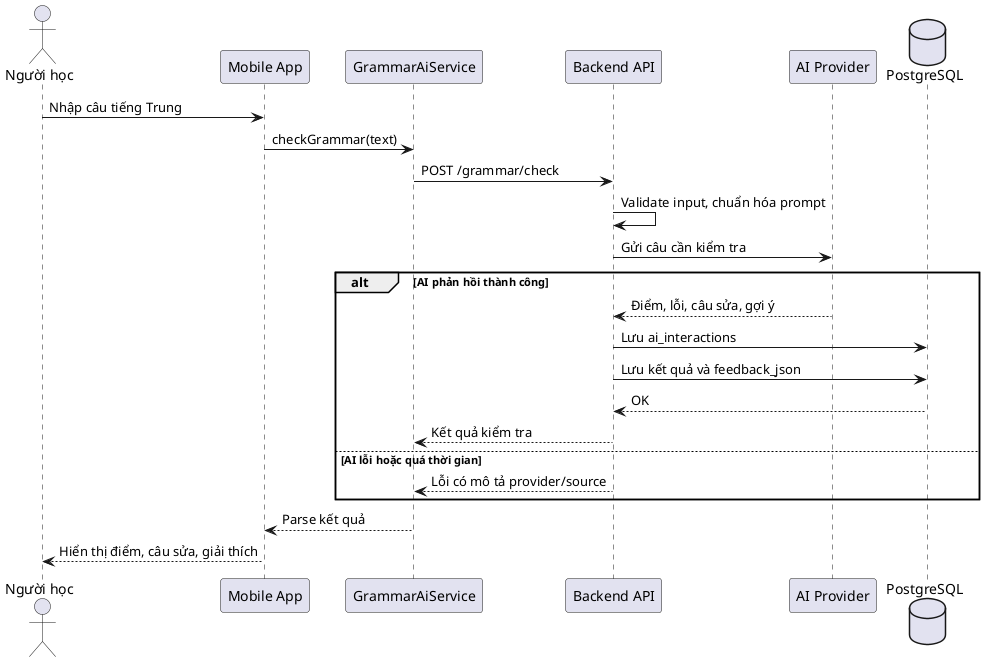
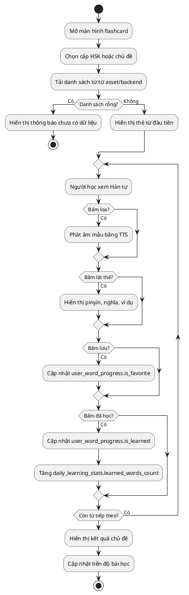
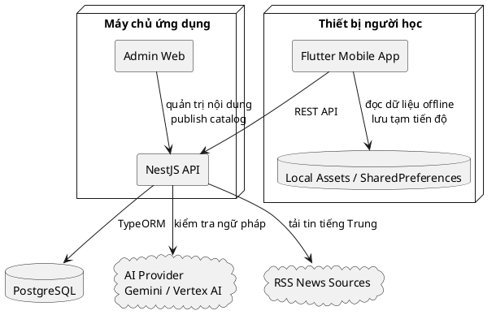
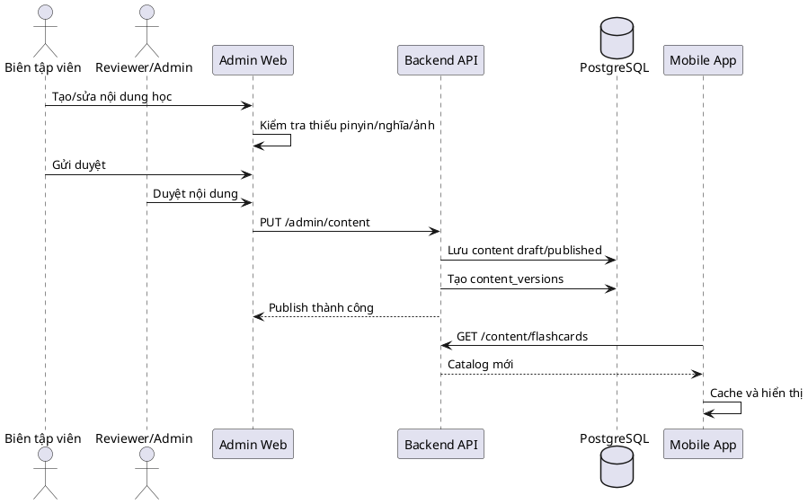

# BÁO CÁO ĐỒ ÁN TỐT NGHIỆP

## Đề tài: Xây dựng ứng dụng học tiếng Trung VNChinese

> **Sinh viên thực hiện:** [Điền họ tên]  
> **Mã sinh viên:** [Điền mã sinh viên]  
> **Lớp:** [Điền lớp]  
> **Ngành:** Kỹ thuật phần mềm / Công nghệ thông tin  
> **Giảng viên hướng dẫn:** [Điền tên giảng viên]  
> **Năm thực hiện:** 2026

---

## Ghi chú về phạm vi tài liệu

Báo cáo này được xây dựng dựa trên:

- Mã nguồn hiện tại của hệ thống VNChinese trong thư mục `apps/mobile`, `api`, `apps/admin`.
- Tài liệu nội bộ của dự án: `docs/APP_FLOW_AND_BUILD_SPEC.md`, `docs/ADMIN_AND_AUTH_BUILD_REPORT.md`, `docs/chuong-2/schema/chinese_learning_app.sql`.
- Báo cáo tham khảo về website quản lý trung tâm giáo dục STEAM EDS và tài liệu CSDL đi kèm. Báo cáo tham khảo có cấu trúc gồm: tổng quan đề tài, phân tích thiết kế hệ thống, biểu đồ use case/tuần tự/hoạt động/lớp, thiết kế cơ sở dữ liệu, thực nghiệm và kết luận. Tài liệu CSDL tham khảo cho thấy một hệ thống giáo dục hoàn chỉnh thường tách dữ liệu thành nhiều miền nghiệp vụ như tài khoản, phân quyền, chương trình học, lớp/buổi học, điểm danh, đánh giá, thanh toán, báo cáo.

Đối với app học tiếng Trung, báo cáo không sao chép mô hình trung tâm giáo dục, mà chuyển hóa tinh thần thiết kế đó sang các miền phù hợp hơn: nội dung học, từ điển, flashcard, ngữ pháp, phát âm, đọc hiểu, tiến độ cá nhân, quản trị nội dung và thống kê học tập.

---

# TÓM TẮT

Trong bối cảnh nhu cầu tự học ngoại ngữ ngày càng tăng, đặc biệt với tiếng Trung, người học cần một công cụ học tập có khả năng kết hợp từ vựng, phát âm, ngữ pháp, đọc hiểu và theo dõi tiến độ trong cùng một trải nghiệm thống nhất. Đề tài này tập trung xây dựng ứng dụng VNChinese, một ứng dụng học tiếng Trung định hướng HSK, phát triển bằng Flutter cho phía người học, NestJS cho backend API, PostgreSQL cho cơ sở dữ liệu và một giao diện admin web để quản trị học liệu.

Ứng dụng hiện có các chức năng chính: học flashcard theo chủ đề, tra từ, nghe phát âm bằng TTS, luyện phát âm bằng Speech-to-Text, học ngữ pháp, kiểm tra ngữ pháp bằng AI, đọc bài/tin tức tiếng Trung, lưu từ vào sổ tay, đặt mục tiêu học tập và xem thống kê. Dữ liệu hiện tại bao gồm 20 chủ đề flashcard với 192 từ, 3.172 từ HSK compact, 11.470 mục từ HSK tổng hợp, 231 bài ngữ pháp HSK 1-4, 80 câu đọc HSK, 4 bài đọc seed và 18 bài video.

Về cơ sở dữ liệu, backend hiện mới đăng ký 9 entity chính: `users`, `course_levels`, `lessons`, `vocabularies`, `example_sentences`, `grammar`, `quiz_questions`, `articles`, `user_progress`. Cấu trúc này đủ cho giai đoạn MVP, nhưng còn thiếu chuẩn hóa cho các chức năng quan trọng như chủ đề flashcard, ví dụ từ vựng, lịch sử kiểm tra ngữ pháp, lịch sử phát âm, video shadowing, phiên đọc bài, mục tiêu ngày, thống kê ngày, phiên bản publish và nhật ký admin. Sau khi đối chiếu các luồng thực tế của app, số bảng tối ưu cho bản đồ án là **20 bảng**: gọn hơn mô hình 30+ bảng, nhưng vẫn đủ cho app học tiếng Trung có admin quản trị nội dung.

---

# MỤC LỤC ĐỀ XUẤT

1. Chương 1: Tổng quan và cơ sở lý thuyết  
2. Chương 2: Phân tích và thiết kế hệ thống  
3. Chương 3: Thiết kế cơ sở dữ liệu  
4. Chương 4: Phát triển và triển khai hệ thống  
5. Chương 5: Thực nghiệm, đánh giá và hướng mở rộng  
6. Kết luận  
7. Phụ lục PlantUML

---

# CHƯƠNG 1: TỔNG QUAN VÀ CƠ SỞ LÝ THUYẾT

## 1.1. Giới thiệu đề tài

VNChinese là ứng dụng hỗ trợ học tiếng Trung trên thiết bị di động, hướng đến người học Việt Nam ở trình độ sơ cấp đến trung cấp. Ứng dụng tập trung vào quá trình học theo HSK, bao gồm từ vựng, mẫu câu, ví dụ, ngữ pháp, luyện phát âm, đọc hiểu và thống kê tiến độ.

Điểm khác biệt của ứng dụng là cách tổ chức học liệu theo hướng gần với nhu cầu tự học hằng ngày: người học có thể mở app để học nhanh một nhóm từ, lưu từ khó, tra nghĩa ngay trong bài đọc, kiểm tra phát âm, kiểm tra câu tiếng Trung bằng AI và xem tiến độ học tập theo ngày. Ngoài ra, hệ thống có backend và admin web để mở rộng từ app học cá nhân thành một nền tảng học liệu có thể quản trị tập trung.

## 1.2. Lý do chọn đề tài

Các ứng dụng học ngoại ngữ phổ biến thường mạnh ở một vài chức năng riêng lẻ như flashcard, từ điển hoặc luyện nghe. Tuy nhiên, với người Việt học tiếng Trung, quá trình học thường cần kết hợp nhiều yếu tố:

- Hán tự, pinyin, nghĩa tiếng Việt và Hán Việt.
- Ví dụ câu có dịch nghĩa rõ ràng.
- Luyện phát âm có phản hồi.
- Ngữ pháp theo cấp độ HSK.
- Đọc hiểu trong ngữ cảnh thật.
- Theo dõi từ đã học, từ đã lưu, streak và mục tiêu ngày.

Do đó, đề tài lựa chọn xây dựng một ứng dụng học tiếng Trung tích hợp nhiều phân hệ học tập trong cùng một sản phẩm. Đề tài có ý nghĩa thực tiễn vì có thể sử dụng ngay cho người học cá nhân, đồng thời có thể mở rộng thành hệ thống quản lý học liệu cho giáo viên, trung tâm hoặc cộng đồng học tiếng Trung.

## 1.3. Mục tiêu nghiên cứu

Mục tiêu tổng quát của đề tài là xây dựng một ứng dụng học tiếng Trung có khả năng hoạt động offline-first, kết nối API khi cần, quản lý học liệu tập trung và lưu tiến độ học tập của người dùng.

Các mục tiêu cụ thể:

- Tìm hiểu quy trình xây dựng ứng dụng mobile bằng Flutter.
- Tìm hiểu xây dựng backend API bằng NestJS và TypeORM.
- Thiết kế cơ sở dữ liệu PostgreSQL cho hệ thống học ngoại ngữ.
- Xây dựng luồng học từ vựng, flashcard, quiz, sổ tay và thống kê.
- Xây dựng chức năng học ngữ pháp và kiểm tra ngữ pháp bằng AI.
- Xây dựng chức năng đọc bài/tin tiếng Trung và tra từ trong ngữ cảnh.
- Xây dựng chức năng luyện phát âm bằng TTS và Speech-to-Text.
- Đề xuất mô hình admin để quản trị học liệu, publish nội dung và kiểm soát chất lượng.

## 1.4. Phạm vi nghiên cứu

Phạm vi đã triển khai trong mã nguồn hiện tại:

- Mobile app Flutter cho người học.
- Backend NestJS API cho từ điển, ngữ pháp, đọc tin, auth và quản trị nội dung.
- Admin web tĩnh để quản lý nội dung và publish catalog.
- Dữ liệu học offline bằng JSON asset.
- CSDL PostgreSQL với 9 entity TypeORM hiện có.

Phạm vi đề xuất mở rộng:

- Đồng bộ tiến độ người học lên backend thay vì chỉ lưu cục bộ.
- Chuẩn hóa CSDL từ 9 bảng lên 20 bảng tối ưu cho bản app có admin cơ bản.
- Quản lý phiên đăng nhập, phiên bản nội dung, media asset và audit log.
- Lưu lịch sử kiểm tra ngữ pháp, phát âm, đọc bài và tra từ trong bài.
- Phát triển admin production có workflow `draft -> review -> published -> archived`.

## 1.5. Công nghệ sử dụng

| Thành phần | Công nghệ | Vai trò |
| --- | --- | --- |
| Mobile app | Flutter, Dart | Xây dựng giao diện và trải nghiệm học cho người dùng |
| Backend API | NestJS, TypeScript | Cung cấp API tra từ, ngữ pháp, đọc bài, auth và admin |
| Cơ sở dữ liệu | PostgreSQL | Lưu người dùng, học liệu, tiến độ và lịch sử học tập |
| ORM | TypeORM | Ánh xạ entity TypeScript sang bảng dữ liệu |
| Admin web | HTML, CSS, JavaScript | Quản trị nội dung, import/export và publish catalog |
| AI | Gemini / Vertex AI | Kiểm tra ngữ pháp, gợi ý sửa câu |
| Âm thanh | flutter_tts, speech_to_text | Nghe mẫu và nhận dạng phát âm |
| Dữ liệu offline | JSON asset | Chạy nhanh, học được khi không có mạng |

## 1.6. Cơ sở lý thuyết

### 1.6.1. Mô hình học theo HSK

HSK là hệ thống đánh giá năng lực tiếng Trung phổ biến, chia nội dung học theo cấp độ. Ứng dụng định hướng dữ liệu theo HSK để người học có thể học từ dễ đến khó, đồng thời theo dõi tiến độ rõ ràng.

### 1.6.2. Offline-first

Offline-first là cách thiết kế trong đó ứng dụng ưu tiên dữ liệu cục bộ để phản hồi nhanh và vẫn dùng được khi không có mạng. Với VNChinese, các file JSON trong `apps/mobile/assets/data` và ảnh trong `apps/mobile/assets/images/flashcards` giúp người học vẫn có thể học từ, flashcard, ngữ pháp và đọc câu mẫu cơ bản khi offline.

### 1.6.3. REST API và mô hình client-server

Ứng dụng sử dụng API để mở rộng dữ liệu, đồng bộ người dùng, quản trị nội dung và tích hợp AI. Mobile app là client, backend NestJS đóng vai trò server xử lý logic, truy cập CSDL và gọi dịch vụ ngoài.

### 1.6.4. Cơ sở dữ liệu quan hệ

PostgreSQL được sử dụng để lưu dữ liệu có quan hệ rõ ràng như người dùng, từ vựng, bài học, ví dụ, tiến độ, lịch sử kiểm tra ngữ pháp, phiên đọc bài và thống kê ngày. Việc chuẩn hóa dữ liệu giúp giảm trùng lặp, dễ truy vấn, dễ kiểm thử chất lượng học liệu và dễ mở rộng.

---

# CHƯƠNG 2: PHÂN TÍCH VÀ THIẾT KẾ HỆ THỐNG

## 2.1. Khảo sát báo cáo tham khảo

Báo cáo tham khảo về website quản lý trung tâm giáo dục STEAM EDS có bố cục rất đầy đủ cho một đồ án tốt nghiệp:

- Chương 1 trình bày tổng quan đề tài, lý do chọn đề tài, mục tiêu, phạm vi và ý nghĩa thực tiễn.
- Chương 2 phân tích và thiết kế hệ thống, có mô tả yêu cầu, use case, đặc tả use case, biểu đồ tuần tự, biểu đồ hoạt động, biểu đồ lớp và thiết kế CSDL.
- Chương 3 mô tả phát triển và triển khai hệ thống.
- Chương 4 trình bày thực nghiệm, so sánh và đánh giá.
- Phần phụ lục mô tả chi tiết các bảng CSDL.

Tài liệu CSDL tham khảo cho hệ thống STEAM EDS có nhiều nhóm bảng: tài khoản, quan hệ phụ huynh-học sinh, đánh giá, điểm danh, thanh toán, trung tâm, phòng học, buổi học, lớp học, chương trình học, ghi danh và sản phẩm học sinh. Điều này cho thấy với một hệ thống giáo dục có tính vận hành thực tế, số bảng thường nằm ở mức vài chục bảng để tách rõ từng miền nghiệp vụ.

Đối với VNChinese, nghiệp vụ không cần các bảng như lớp học, phòng học, học phí hay phụ huynh. Tuy nhiên, hệ thống vẫn nên có nhiều bảng hơn 9 bảng hiện tại để phản ánh đầy đủ các miền: nội dung học, tiến độ, luyện phát âm, đọc hiểu, AI, quản trị và thống kê.

## 2.2. Mô tả hệ thống VNChinese

VNChinese gồm ba phần chính:

- **Ứng dụng người học:** Flutter app trong `apps/mobile`.
- **Backend API:** NestJS service trong `api`.
- **Admin web:** giao diện quản trị nội dung trong `apps/admin`.

Luồng vận hành tổng quát:

1. Người học mở mobile app.
2. App nạp dữ liệu offline từ asset để hiển thị nhanh.
3. Khi cần dữ liệu mở rộng, app gọi API backend.
4. Backend truy vấn PostgreSQL hoặc gọi dịch vụ ngoài như RSS/AI.
5. Admin web quản lý nội dung và publish catalog để app tải về.

## 2.3. Tác nhân hệ thống

| Tác nhân | Mô tả |
| --- | --- |
| Người học | Sử dụng app để học từ vựng, ngữ pháp, phát âm, đọc bài, làm quiz và xem tiến độ |
| Khách học thử | Dùng app không cần tài khoản, dữ liệu chủ yếu lưu cục bộ |
| Quản trị viên | Quản lý người dùng, học liệu, nguồn bài đọc, video, nội dung publish |
| Biên tập viên nội dung | Tạo/sửa từ vựng, flashcard, ngữ pháp, quiz, bài đọc |
| Dịch vụ AI | Chấm ngữ pháp, gợi ý sửa câu và hỗ trợ gia sư AI |
| Nguồn RSS | Cung cấp tin/bài đọc tiếng Trung |
| Dịch vụ âm thanh | TTS đọc mẫu và Speech-to-Text nhận dạng giọng nói |

## 2.4. Yêu cầu chức năng

### 2.4.1. Phân hệ tài khoản

- Người dùng có thể đăng ký, đăng nhập, đăng xuất.
- Người dùng có thể học thử không cần tài khoản.
- Admin có thể tạo, sửa, khóa hoặc mở khóa người dùng.
- Hệ thống phân biệt quyền người học và admin.

### 2.4.2. Phân hệ từ vựng và flashcard

- Tra từ bằng Hán tự, pinyin, Hán Việt hoặc nghĩa tiếng Việt.
- Hiển thị chữ giản thể, phồn thể, pinyin, nghĩa tiếng Việt, nghĩa tiếng Anh, loại từ, bộ thủ, số nét và ví dụ.
- Học flashcard theo chủ đề và cấp độ HSK.
- Nghe phát âm mẫu bằng TTS.
- Lưu từ vào sổ tay.
- Đánh dấu từ đã học.
- Làm quiz theo chủ đề hoặc cấp độ.

### 2.4.3. Phân hệ ngữ pháp và AI

- Xem bài ngữ pháp theo cấp HSK.
- Xem mẫu câu, giải thích và ví dụ.
- Nhập câu tiếng Trung để kiểm tra ngữ pháp.
- Nhận điểm, lỗi sai, câu sửa, pinyin, dịch nghĩa và gợi ý cải thiện.
- Lưu lịch sử kiểm tra để người học xem lại.

### 2.4.4. Phân hệ phát âm

- Chọn câu hoặc từ để luyện phát âm.
- Nghe mẫu bằng TTS.
- Ghi âm/nhận dạng giọng nói.
- So sánh kết quả nhận dạng với câu mục tiêu.
- Lưu điểm phát âm và lịch sử luyện tập.

### 2.4.5. Phân hệ đọc hiểu

- Đọc câu HSK hoặc bài tin tiếng Trung.
- Lọc tin theo nguồn RSS.
- Nghe bài/câu bằng TTS.
- Chạm vào từ trong bài để tra nghĩa.
- Lưu từ vừa tra vào sổ tay.
- Lưu phiên đọc, số từ đã tra và thời gian đọc.

### 2.4.6. Phân hệ thống kê

- Theo dõi số từ đã học.
- Theo dõi số từ đã lưu.
- Theo dõi số phút học trong ngày.
- Theo dõi streak.
- Đặt mục tiêu số từ/ngày và phút/ngày.
- Tổng hợp thống kê học tập theo ngày.

### 2.4.7. Phân hệ quản trị nội dung

- Quản lý từ điển và ví dụ.
- Quản lý flashcard topic và danh sách từ.
- Quản lý ảnh/media.
- Quản lý bài ngữ pháp.
- Quản lý quiz và mini game.
- Quản lý nguồn RSS.
- Import/export/publish content bundle.
- Kiểm tra chất lượng dữ liệu: thiếu pinyin, thiếu nghĩa, thiếu ảnh, lỗi mojibake.

## 2.5. Yêu cầu phi chức năng

| Nhóm yêu cầu | Nội dung |
| --- | --- |
| Hiệu năng | Tra từ local phản hồi gần như tức thời; API tra từ nên phản hồi dưới 2 giây; AI nên phản hồi dưới 5-10 giây |
| Khả dụng | App vẫn học được các nội dung chính khi offline |
| Bảo mật | Không lưu API key quan trọng ở mobile khi triển khai thật; mật khẩu phải hash; admin phải phân quyền |
| Mở rộng | CSDL phải hỗ trợ HSK 5-6, TOCFL, nhiều loại bài học và đồng bộ đa thiết bị |
| Toàn vẹn dữ liệu | Bảng quan hệ phải có khóa ngoại, unique constraint và index cho truy vấn thường dùng |
| Trải nghiệm | UI mobile cần đơn giản, dễ học nhanh, có phản hồi rõ khi lỗi mạng hoặc thiếu dữ liệu |

## 2.6. Đặc tả use case chính

| Mã | Tên use case | Tác nhân | Mục tiêu |
| --- | --- | --- | --- |
| UC01 | Đăng ký/đăng nhập | Người học | Tạo phiên học cá nhân và đồng bộ tiến độ |
| UC02 | Tra từ vựng | Người học | Tìm nghĩa, pinyin, ví dụ và phát âm của từ |
| UC03 | Học flashcard | Người học | Học từ theo chủ đề/HSK và cập nhật tiến độ |
| UC04 | Làm quiz | Người học | Tự kiểm tra từ vựng/ngữ pháp |
| UC05 | Xem ngữ pháp | Người học | Học mẫu câu theo HSK |
| UC06 | Kiểm tra ngữ pháp AI | Người học | Nhận phản hồi, câu sửa và gợi ý |
| UC07 | Luyện phát âm | Người học | Đọc lại từ/câu và nhận điểm |
| UC08 | Đọc bài và tra từ | Người học | Đọc tiếng Trung trong ngữ cảnh và lưu từ mới |
| UC09 | Xem thống kê | Người học | Theo dõi mục tiêu ngày và tiến độ dài hạn |
| UC10 | Quản lý học liệu | Admin | Tạo, sửa, duyệt và publish nội dung |

## 2.7. Biểu đồ Use Case tổng quát

## 2.8. Biểu đồ tuần tự: tra từ vựng

## 2.9. Biểu đồ tuần tự: kiểm tra ngữ pháp AI

## 2.10. Biểu đồ hoạt động: học flashcard

## 2.11. Biểu đồ triển khai

---

# CHƯƠNG 3: THIẾT KẾ CƠ SỞ DỮ LIỆU

## 3.1. Hiện trạng cơ sở dữ liệu

Backend hiện đăng ký 9 entity TypeORM:

| STT | Bảng/entity | Vai trò hiện tại |
| --- | --- | --- |
| 1 | `users` | Tài khoản người dùng/admin |
| 2 | `course_levels` | Cấp học như HSK 1, HSK 2 |
| 3 | `lessons` | Bài học thuộc cấp học |
| 4 | `vocabularies` | Từ vựng, pinyin, nghĩa, ví dụ JSON |
| 5 | `example_sentences` | Kho câu ví dụ theo từ |
| 6 | `grammar` | Bài ngữ pháp, ví dụ lưu JSON |
| 7 | `quiz_questions` | Câu hỏi quiz theo bài |
| 8 | `articles` | Bài đọc/tin tức đã lưu |
| 9 | `user_progress` | Tiến độ bài học, yêu thích, điểm, số lần ôn |

Nhận xét: 9 bảng này đủ cho MVP vì nhiều dữ liệu được lưu trong JSON asset hoặc JSONB. Tuy nhiên, nếu trình bày như đồ án tốt nghiệp và định hướng triển khai thực tế, cấu trúc này còn thiếu nhiều bảng để thể hiện rõ quan hệ dữ liệu.

## 3.2. Vì sao 9 bảng là chưa đủ

Các vấn đề chính:

- `vocabularies` đang chứa `examples` và `definitions` dạng JSONB; khó truy vấn ví dụ, khó kiểm tra chất lượng từng câu, khó thống kê câu dùng nhiều.
- `grammar` đang gộp nội dung chưa thống nhất; nên chuẩn hóa thành `grammar_lessons`, nhưng có thể giữ ví dụ trong `examples_json` để giảm số bảng.
- `user_progress` đang gộp nhiều ý nghĩa: tiến độ bài, yêu thích, điểm phát âm và grammar check. Nên tách tiến độ từ sang `user_word_progress`, còn lịch sử quiz/phát âm/video sang `practice_attempts`.
- Flashcard topic hiện chủ yếu nằm trong JSON asset, chưa có bảng `topics` và `topic_vocabularies`.
- Bài đọc live có nguồn RSS nhưng CSDL chưa tách `article_sources`.
- Chưa có bảng lưu phiên đọc bài và từ đã tra trong bài.
- Chưa có bảng lưu lịch sử kiểm tra ngữ pháp AI, lỗi và gợi ý.
- Chưa có bảng lưu bài/câu phát âm và lịch sử luyện phát âm.
- Mục tiêu ngày và thống kê ngày hiện lưu local, chưa đồng bộ backend.
- Admin publish nội dung chưa có bảng phiên bản nội dung, media asset và audit log.

## 3.3. Đề xuất mở rộng CSDL

### 3.3.1. Đánh giá số lượng bảng phù hợp

Đối với một ứng dụng học tiếng Trung chỉ chạy offline và không có admin, 9-12 bảng là đủ. Tuy nhiên VNChinese có thêm backend, tài khoản, thống kê, AI, đọc báo, video, phát âm và admin quản trị nội dung. Nếu tách quá chi tiết, hệ thống có thể lên 30+ bảng; nhưng với đồ án tốt nghiệp, thiết kế như vậy hơi nặng và khó triển khai hết.

Phương án hợp lý là **20 bảng**. Đây là mức cân bằng giữa tính chuẩn hóa và tính gọn nhẹ:

- Ít hơn nhiều so với hệ quản lý giáo dục trung tâm vì app không có lớp học, học phí, phụ huynh, phòng học.
- Đủ nhiều hơn 9 bảng hiện tại để không gộp sai các dữ liệu quan trọng vào một bảng chung.
- Vẫn có bảng admin thật: `content_versions` và `admin_audit_logs`.
- Giữ được các luồng chính: học từ, flashcard, ngữ pháp, quiz, đọc, phát âm, video, AI, thống kê, publish nội dung.
- Các dữ liệu phụ như lỗi AI chi tiết, từ đã tra trong bài đọc, transcript/video metadata có thể lưu JSONB trong bảng cha để giảm số bảng.

### 3.3.2. Nguyên tắc chọn số bảng tối ưu

| Nguyên tắc | Cách áp dụng trong VNChinese |
| --- | --- |
| Tách bảng khi dữ liệu là miền nghiệp vụ chính | Ví dụ từ vựng, chủ đề, bài đọc, phát âm, tiến độ, phiên bản publish |
| Gộp bằng JSONB khi dữ liệu phụ, ít truy vấn độc lập | Ví dụ lỗi/gợi ý AI trong `ai_interactions.response_json`, từ đã tra trong `reading_sessions.looked_up_words_json` |
| Không tách bảng admin riêng nếu admin cũng là user | Dùng `users.role` để phân biệt `learner`, `admin`, `editor`, `reviewer` |
| Không tách bảng media riêng ở bản đồ án | Lưu `image_path`, `audio_path` trong bảng liên quan; chỉ thêm `media_assets` khi có upload/storage thật |
| Ưu tiên dễ bảo vệ đồ án và dễ triển khai | Mỗi bảng phải giải thích được phục vụ luồng nào, tránh thêm bảng chỉ để tăng số lượng |

### 3.3.3. Sắp xếp 20 bảng theo từng luồng

| Nhóm luồng | Bảng | Số bảng | Mục đích |
| --- | --- | ---: | --- |
| Tài khoản và admin | `users`, `admin_audit_logs` | 2 | Người học/admin/editor/reviewer và nhật ký thao tác quản trị |
| Khung học HSK | `course_levels`, `lessons` | 2 | Cấp học và bài học tổng quát cho từ vựng, ngữ pháp, đọc, phát âm, video |
| Từ điển và flashcard | `topics`, `vocabularies`, `topic_vocabularies`, `vocabulary_examples` | 4 | Chủ đề, từ, ví dụ và mapping từ vào topic |
| Ngữ pháp và quiz | `grammar_lessons`, `quiz_questions` | 2 | Bài ngữ pháp và ngân hàng câu hỏi; ví dụ ngữ pháp lưu JSONB trong bài |
| Đọc hiểu | `article_sources`, `articles`, `reading_sessions` | 3 | Nguồn RSS, bài đọc, phiên đọc và từ đã tra lưu JSONB |
| Phát âm và video | `pronunciation_sentences`, `video_transcript_lines` | 2 | Câu luyện nói và transcript video theo từng dòng |
| Tiến độ và lịch sử luyện tập | `user_word_progress`, `practice_attempts`, `daily_learning_stats` | 3 | Tiến độ từng từ, từng lần quiz/phát âm/video và thống kê ngày |
| AI | `ai_interactions` | 1 | Dùng chung cho kiểm tra ngữ pháp và hội thoại Gia sư AI |
| Publish nội dung | `content_versions` | 1 | Phiên bản bundle, rollback và trạng thái publish |
| **Tổng** |  | **20** |  |

### 3.3.4. Phân loại theo mức ưu tiên triển khai

| Mức | Số bảng | Bảng nên có |
| --- | ---: | --- |
| MVP đang có | 9 | `users`, `course_levels`, `lessons`, `vocabularies`, `example_sentences`, `grammar`, `quiz_questions`, `articles`, `user_progress` |
| Bản gọn hiệu quả | 15-16 | Bỏ bớt video transcript/admin audit, lưu nhiều dữ liệu bằng JSONB |
| Bản khuyến nghị cho đồ án | 20 | Đủ app người học, admin cơ bản, publish version, audit log |
| Bản thương mại lớn | 28+ | Chỉ cần khi thêm upload media thật, RBAC chi tiết, notification, gói học, thanh toán |

### 3.3.5. Vì sao chưa cần tách bảng `admins`

Không nên tạo bảng `admins` riêng nếu admin cũng là người dùng đăng nhập. Thiết kế tốt hơn là dùng chung bảng `users`, có cột `role` hoặc `user_type` để phân biệt:

- `learner`: người học.
- `admin`: quản trị viên toàn quyền.
- `editor`: người nhập/sửa học liệu.
- `reviewer`: người duyệt nội dung.

Cách này tránh trùng dữ liệu tài khoản, email, mật khẩu và phiên đăng nhập. Những dữ liệu riêng của admin được lưu ở các bảng nghiệp vụ admin gọn hơn:

- `content_versions`: lưu lần publish nội dung, ai publish, trạng thái, số lượng nội dung và đường dẫn bundle.
- `admin_audit_logs`: lưu admin/editor đã tạo, sửa, xóa, duyệt, publish dữ liệu nào.

Như vậy báo cáo vẫn có phần admin rõ ràng mà không phải tăng lên quá nhiều bảng.

## 3.4. Thiết kế bảng chi tiết

Để báo cáo ngắn gọn, 20 bảng được mô tả theo nhóm như sau:

### 3.4.1. Nhóm tài khoản và admin

| Bảng | Cột chính | Vai trò |
| --- | --- | --- |
| `users` | `id`, `email`, `password_hash`, `display_name`, `avatar_url`, `role`, `status`, `target_hsk_level`, `daily_goal_words`, `daily_goal_minutes`, `last_login_at`, `created_at`, `updated_at` | Dùng chung cho learner/admin/editor/reviewer |
| `admin_audit_logs` | `id`, `admin_id`, `action`, `entity_type`, `entity_id`, `change_data`, `created_at` | Ghi lại các thao tác thêm, sửa, xóa, duyệt, publish |

Không tạo bảng `admins` riêng; quyền admin được xác định bằng `users.role`.

### 3.4.2. Nhóm khung học HSK

| Bảng | Cột chính | Vai trò |
| --- | --- | --- |
| `course_levels` | `id`, `code`, `level_number`, `name`, `description`, `display_order`, `active` | Hiện dùng HSK 1-4, có thể mở rộng HSK 5-6 |
| `lessons` | `id`, `course_level_id`, `code`, `title`, `lesson_type`, `description`, `content_json`, `display_order`, `status` | Bài học tổng quát; `lesson_type` gồm vocabulary, grammar, reading, pronunciation, video, quiz |

`content_json` dùng cho metadata nhỏ theo từng loại bài, tránh tạo quá nhiều bảng phụ.

### 3.4.3. Nhóm từ điển và flashcard

| Bảng | Cột chính | Vai trò |
| --- | --- | --- |
| `topics` | `id`, `code`, `name`, `hsk_level`, `description`, `image_path`, `display_order`, `status` | Chủ đề flashcard |
| `vocabularies` | `id`, `simplified`, `traditional`, `pinyin`, `meaning_vi`, `meaning_en`, `han_viet`, `part_of_speech`, `radical`, `hsk_level`, `stroke_count`, `metadata` | Dữ liệu từ điển chính |
| `topic_vocabularies` | `topic_id`, `vocabulary_id`, `image_path`, `display_order` | Gắn từ vào chủ đề và ảnh flashcard |
| `vocabulary_examples` | `id`, `vocabulary_id`, `example_cn`, `example_pinyin`, `example_vi`, `source`, `display_order` | Ví dụ của từng từ |

### 3.4.4. Nhóm ngữ pháp và quiz

| Bảng | Cột chính | Vai trò |
| --- | --- | --- |
| `grammar_lessons` | `id`, `lesson_id`, `hsk_level`, `title`, `pattern_text`, `explanation`, `examples_json`, `status` | Bài ngữ pháp; ví dụ lưu JSONB để giảm một bảng |
| `quiz_questions` | `id`, `lesson_id`, `question_type`, `question_text`, `options_json`, `correct_answer`, `explanation`, `difficulty`, `status` | Ngân hàng câu hỏi |

Kết quả mỗi lần quiz được lưu trong `practice_attempts`, chưa cần bảng `quiz_attempts` riêng.

### 3.4.5. Nhóm đọc hiểu

| Bảng | Cột chính | Vai trò |
| --- | --- | --- |
| `article_sources` | `id`, `name`, `source_type`, `source_url`, `default_hsk_level`, `active` | Quản lý nguồn nội dung thủ công, RSS hoặc API |
| `articles` | `id`, `external_id`, `source_id`, `title`, `title_vi`, `summary_vi`, `content`, `sentences_json`, `link`, `hsk_level`, `published_at`, `status` | Bài đọc/tin tức |
| `reading_sessions` | `id`, `user_id`, `article_id`, `time_spent_seconds`, `looked_up_words_json`, `completed`, `last_read_at` | Phiên đọc và danh sách từ đã tra lưu JSONB |

### 3.4.6. Nhóm phát âm và video

| Bảng | Cột chính | Vai trò |
| --- | --- | --- |
| `pronunciation_sentences` | `id`, `lesson_id`, `sentence_cn`, `sentence_pinyin`, `sentence_vi`, `difficulty`, `display_order`, `status` | Câu luyện phát âm |
| `video_transcript_lines` | `id`, `lesson_id`, `line_number`, `start_seconds`, `end_seconds`, `sentence_cn`, `sentence_pinyin`, `sentence_vi` | Phụ đề có timing cho video shadowing |

Thông tin video như YouTube ID, nguồn và trạng thái transcript được lưu trong `lessons.content_json`.

### 3.4.7. Nhóm tiến độ và lịch sử luyện tập

| Bảng | Cột chính | Vai trò |
| --- | --- | --- |
| `user_word_progress` | `id`, `user_id`, `vocabulary_id`, `is_favorite`, `mastery_level`, `review_count`, `correct_count`, `next_review_at`, `last_reviewed_at` | Sổ tay, mức độ ghi nhớ và lịch ôn từng từ |
| `practice_attempts` | `id`, `user_id`, `lesson_id`, `attempt_type`, `target_id`, `score`, `correct_count`, `total_count`, `duration_seconds`, `result_json`, `completed_at` | Lưu từng lần làm quiz, luyện phát âm, đọc hoặc video shadowing |
| `daily_learning_stats` | `id`, `user_id`, `study_date`, `learned_words_count`, `reviewed_words_count`, `lessons_completed_count`, `quiz_count`, `pronunciation_count`, `reading_count`, `ai_interaction_count`, `study_seconds`, `streak_snapshot` | Thống kê tổng hợp theo ngày; mục tiêu mặc định đặt trong `users` |

`practice_attempts` thay cho `user_lesson_progress`: tiến độ bài học được xác định bằng lần luyện gần nhất, số lần luyện và điểm cao nhất. Cách này tránh lưu trùng dữ liệu giữa bảng lịch sử và bảng tiến độ tổng hợp.

### 3.4.8. Nhóm AI

| Bảng | Cột chính | Vai trò |
| --- | --- | --- |
| `ai_interactions` | `id`, `user_id`, `interaction_type`, `session_key`, `input_text`, `response_text`, `score`, `response_json`, `provider`, `model`, `status`, `error_code`, `duration_ms`, `created_at` | Dùng cho cả `grammar_check` và `tutor_chat`, đồng thời lưu được lỗi 429/503 để theo dõi AI |

### 3.4.9. Nhóm publish nội dung

| Bảng | Cột chính | Vai trò |
| --- | --- | --- |
| `content_versions` | `id`, `version_code`, `content_type`, `description`, `source_checksum`, `item_count`, `status`, `published_by`, `published_at` | Quản lý phiên bản, checksum, số lượng dữ liệu và lần publish |

Kết hợp `users.role`, `content_versions` và `admin_audit_logs` là đủ cho admin cơ bản. Chỉ khi hệ thống có đội ngũ biên tập lớn mới cần tách thêm `roles`, `permissions`, `content_review_tasks` hoặc `system_settings`.

### 3.4.10. Dữ liệu đã nạp phục vụ ứng dụng

Bộ seed được xây dựng từ chính các tài nguyên trong `apps/mobile/assets`, có thể chạy lặp lại bằng lệnh `npm run seed:app-data` mà không tạo bản ghi trùng. Kết quả kiểm tra trên PostgreSQL của dự án:

| Nhóm dữ liệu | Số lượng |
| --- | ---: |
| Cấp độ đang hoạt động | 4 cấp HSK 1-4 |
| Bài học tổng quát | 304 |
| Chủ đề flashcard | 20 |
| Từ vựng hiện có trong kho | 121.196 |
| Liên kết từ vựng - chủ đề | 192 |
| Ví dụ từ vựng chuẩn hóa | 272 |
| Bài ngữ pháp | 231 |
| Câu hỏi quiz | 387 |
| Nguồn bài đọc | 2 |
| Bài/câu đọc | 90 |
| Câu luyện phát âm | 80 |
| Dòng transcript video | 568 |
| Phiên bản dữ liệu đã publish | 5 |

Các bảng `reading_sessions`, `practice_attempts`, `user_word_progress`, `daily_learning_stats`, `ai_interactions` và `admin_audit_logs` không được nạp dữ liệu giả. Bản ghi chỉ được tạo khi người học đọc bài, làm quiz, luyện phát âm, dùng AI hoặc khi quản trị viên thao tác. Cách này giúp báo cáo thống kê và lịch sử phản ánh đúng hành vi thực tế.

Cơ sở dữ liệu đang chạy được nâng cấp tại chỗ nên tạm giữ ba bảng cũ `grammar`, `example_sentences` và `user_progress` để các API TypeORM hiện tại không bị gián đoạn. Đây là lớp tương thích chuyển tiếp, không thuộc mô hình đích 20 bảng. Sau khi controller cũ chuyển hoàn toàn sang `grammar_lessons`, `vocabulary_examples`, `practice_attempts` và `user_word_progress`, có thể sao lưu rồi loại bỏ ba bảng cũ. Cấu hình `synchronize` của TypeORM cũng được chuyển sang chỉ bật khi đặt `DB_SYNC=true`, tránh tự động xóa hoặc đổi các cột đã chuẩn hóa.

## 3.5. ERD đề xuất bằng PlantUML

```plantuml
@startuml
hide circle
skinparam linetype ortho
skinparam entity {
  BackgroundColor #FFFFFF
  BorderColor #333333
}

entity "users" as users {
  * id : bigint <<PK>>
  --
  email : varchar
  password_hash : varchar
  display_name : varchar
  role : varchar
  status : varchar
  target_hsk_level : smallint
  daily_goal_words : smallint
  daily_goal_minutes : smallint
  created_at : timestamptz
}

entity "admin_audit_logs" as admin_audit_logs {
  * id : bigint <<PK>>
  --
  admin_id : bigint <<FK>>
  action : varchar
  entity_type : varchar
  entity_id : varchar
  change_data : jsonb
  created_at : timestamptz
}

entity "course_levels" as course_levels {
  * id : bigint <<PK>>
  --
  code : varchar
  level_number : smallint
  name : varchar
  description : text
  display_order : int
}

entity "lessons" as lessons {
  * id : bigint <<PK>>
  --
  course_level_id : bigint <<FK>>
  code : varchar
  title : varchar
  lesson_type : varchar
  display_order : int
  status : varchar
}

entity "topics" as topics {
  * id : bigint <<PK>>
  --
  code : varchar
  name : varchar
  hsk_level : smallint
  display_order : int
  status : varchar
}

entity "vocabularies" as vocabularies {
  * id : bigint <<PK>>
  --
  simplified : varchar
  traditional : varchar
  pinyin : varchar
  meaning_vi : text
  han_viet : varchar
  part_of_speech : varchar
  hsk_level : int
  metadata : jsonb
}

entity "topic_vocabularies" as topic_vocabularies {
  * topic_id : bigint <<PK, FK>>
  * vocabulary_id : bigint <<PK, FK>>
  --
  image_path : text
  display_order : int
}

entity "vocabulary_examples" as vocabulary_examples {
  * id : bigint <<PK>>
  --
  vocabulary_id : bigint <<FK>>
  example_cn : text
  example_pinyin : text
  example_vi : text
  source : varchar
  display_order : int
}

entity "grammar_lessons" as grammar_lessons {
  * id : bigint <<PK>>
  --
  lesson_id : bigint <<FK>>
  hsk_level : smallint
  title : varchar
  pattern_text : varchar
  explanation : text
  examples_json : jsonb
}

entity "quiz_questions" as quiz_questions {
  * id : bigint <<PK>>
  --
  lesson_id : bigint <<FK>>
  question_type : varchar
  question_text : text
  options_json : jsonb
  correct_answer : text
}

entity "article_sources" as article_sources {
  * id : bigint <<PK>>
  --
  name : varchar
  source_type : varchar
  source_url : text
  default_hsk_level : smallint
  active : boolean
}

entity "articles" as articles {
  * id : bigint <<PK>>
  --
  source_id : bigint <<FK>>
  external_id : varchar
  title : text
  title_vi : text
  summary_vi : text
  content : text
  sentences_json : jsonb
  link : text
  hsk_level : smallint
  published_at : timestamptz
}

entity "pronunciation_sentences" as pronunciation_sentences {
  * id : bigint <<PK>>
  --
  lesson_id : bigint <<FK>>
  sentence_cn : text
  sentence_pinyin : text
  sentence_vi : text
  difficulty : smallint
}

entity "video_transcript_lines" as video_transcript_lines {
  * id : bigint <<PK>>
  --
  lesson_id : bigint <<FK>>
  line_number : int
  start_seconds : numeric
  end_seconds : numeric
  sentence_cn : text
  sentence_pinyin : text
  sentence_vi : text
}

entity "practice_attempts" as practice_attempts {
  * id : bigint <<PK>>
  --
  user_id : bigint <<FK>>
  lesson_id : bigint <<FK>>
  attempt_type : varchar
  target_id : varchar
  score : numeric
  result_json : jsonb
  completed_at : timestamptz
}

entity "user_word_progress" as user_word_progress {
  * id : bigint <<PK>>
  --
  user_id : bigint <<FK>>
  vocabulary_id : bigint <<FK>>
  is_favorite : boolean
  mastery_level : smallint
  review_count : int
  correct_count : int
  next_review_at : timestamptz
}

entity "ai_interactions" as ai_interactions {
  * id : bigint <<PK>>
  --
  user_id : bigint <<FK>>
  interaction_type : varchar
  session_key : varchar
  input_text : text
  response_text : text
  score : numeric
  response_json : jsonb
  provider : varchar
  model : varchar
  status : varchar
  error_code : varchar
  duration_ms : int
  created_at : timestamptz
}

entity "reading_sessions" as reading_sessions {
  * id : bigint <<PK>>
  --
  user_id : bigint <<FK>>
  article_id : bigint <<FK>>
  time_spent_seconds : int
  looked_up_words_json : jsonb
  completed : boolean
}

entity "daily_learning_stats" as daily_learning_stats {
  * id : bigint <<PK>>
  --
  user_id : bigint <<FK>>
  study_date : date
  learned_words_count : int
  reviewed_words_count : int
  lessons_completed_count : int
  study_seconds : int
  streak_snapshot : int
}

entity "content_versions" as content_versions {
  * id : bigint <<PK>>
  --
  version_code : varchar
  content_type : varchar
  source_checksum : varchar
  item_count : int
  status : varchar
  published_by : bigint <<FK>>
  published_at : timestamptz
}

course_levels ||--o{ lessons
lessons ||--o{ grammar_lessons
lessons ||--o{ quiz_questions
lessons ||--o{ pronunciation_sentences
lessons ||--o{ video_transcript_lines
lessons ||--o{ practice_attempts

topics ||--o{ topic_vocabularies
vocabularies ||--o{ topic_vocabularies
vocabularies ||--o{ vocabulary_examples

users ||--o{ practice_attempts
users ||--o{ user_word_progress
vocabularies ||--o{ user_word_progress

article_sources ||--o{ articles
users ||--o{ reading_sessions
articles ||--o{ reading_sessions

users ||--o{ ai_interactions
users ||--o{ daily_learning_stats
users ||--o{ admin_audit_logs
users ||--o{ content_versions
@enduml
```

## 3.6. Kế hoạch chỉnh sửa CSDL và code

### Giai đoạn 1: Chuẩn hóa bảng nội dung

1. Tạo `topics` và `topic_vocabularies`.
2. Import dữ liệu từ `apps/mobile/assets/images/flashcards/index.json` vào hai bảng này.
3. Tách `vocabularies.examples` sang `vocabulary_examples`.
4. Chuẩn hóa `grammar` thành `grammar_lessons`, giữ ví dụ trong `examples_json`.
5. Bổ sung `article_sources`, thêm `source_id` vào `articles`.
6. Tạo `pronunciation_sentences` và `video_transcript_lines`.

### Giai đoạn 2: Chuẩn hóa tiến độ người học

1. Đổi cách dùng `user_progress` thành tiến độ bài học.
2. Tạo `user_word_progress` để lưu từng từ đã học/yêu thích.
3. Tạo `daily_learning_stats`, gộp mục tiêu số từ/phút vào cùng bản ghi theo ngày.
4. Sửa `ProgressService` mobile để ưu tiên đồng bộ backend khi đã đăng nhập, fallback local khi offline.

### Giai đoạn 3: Lưu lịch sử AI, phát âm và đọc hiểu

1. Tạo `ai_interactions`, lưu cả kiểm tra ngữ pháp, Gia sư AI và lỗi provider trong `response_json`.
2. Tạo `reading_sessions`, lưu danh sách từ đã tra trong `looked_up_words_json`.
3. Tạo `practice_attempts` để lưu từng lần quiz, phát âm, đọc và video.
4. Sửa API `/grammar/check`, màn phát âm và màn đọc bài để ghi lịch sử.

### Giai đoạn 4: Admin và publish

1. Tạo `content_versions` và `admin_audit_logs`.
2. Admin quản lý trạng thái nội dung bằng `draft`, `review`, `published`, `archived`.
3. Publish content bundle có version, có rollback.
4. Tắt `synchronize: true`, chuyển sang TypeORM migration.

---

# CHƯƠNG 4: PHÁT TRIỂN VÀ TRIỂN KHAI HỆ THỐNG

## 4.1. Kiến trúc phần mềm

Hệ thống được xây dựng theo mô hình client-server kết hợp offline-first:

- Mobile app chứa phần lớn dữ liệu học cơ bản trong asset.
- Backend API cung cấp dữ liệu mở rộng, auth, AI, RSS và admin.
- PostgreSQL lưu dữ liệu quan hệ.
- Admin web quản lý nội dung và publish catalog.

Ưu điểm của kiến trúc này:

- App phản hồi nhanh và dùng được khi offline.
- Backend có thể mở rộng dần mà không làm app phụ thuộc hoàn toàn vào mạng.
- Admin có thể quản trị dữ liệu tập trung.
- Dữ liệu quan trọng của người dùng có thể đồng bộ đa thiết bị khi đăng nhập.

## 4.2. Phân hệ mobile

Các màn hình/chức năng chính:

| Phân hệ | File/chức năng tiêu biểu | Mô tả |
| --- | --- | --- |
| Từ điển | `dictionary_search_tab.dart` | Autocomplete, search, detail |
| Từ vựng/flashcard | `main.dart`, `vocabulary_list_screen.dart`, `magic_vocab_screen.dart` | Học theo chủ đề, lưu từ, quiz |
| Ngữ pháp | `grammar_checker_screen.dart`, `grammar_ai_service.dart` | Bài học ngữ pháp, kiểm tra AI |
| Đọc bài | `news_reader_screen.dart` | RSS, đọc bài, TTS, tra từ |
| Phát âm | `pronunciation_screen.dart` | TTS, Speech-to-Text, chấm điểm |
| Tiến độ | `progress_service.dart`, `stats_screen.dart` | Từ đã học, mục tiêu ngày, streak |
| Auth | `auth_service.dart` | Đăng nhập, đăng ký, guest session |

## 4.3. Phân hệ backend

Các API chính:

| API | Chức năng |
| --- | --- |
| `POST /auth/register` | Đăng ký |
| `POST /auth/login` | Đăng nhập |
| `GET /auth/me` | Lấy phiên hiện tại |
| `GET /dictionary/search` | Tìm từ |
| `GET /dictionary/autocomplete` | Gợi ý khi nhập |
| `GET /dictionary/detail/:word` | Chi tiết từ |
| `GET /dictionary/examples-local` | Ví dụ từ kho local |
| `POST /dictionary/cache` | Cache từ mới |
| `GET /grammar` | Danh sách bài ngữ pháp |
| `POST /grammar/check` | Kiểm tra ngữ pháp AI |
| `GET /reading/sources` | Danh sách nguồn RSS |
| `GET /reading/news` | Tin/bài đọc tiếng Trung |
| `GET /content/flashcards` | Catalog flashcard đã publish |
| `GET/PUT /admin/content` | Quản trị catalog |
| `GET/PATCH /admin/users` | Quản lý người dùng |

## 4.4. Phân hệ admin

Admin hiện có vai trò control center cho nội dung:

- Dashboard tổng quan.
- Quản lý từ vựng.
- Quản lý chủ đề và flashcard.
- Quản lý bài học.
- Quản lý video và transcript.
- Quản lý nguồn báo.
- Quản lý quiz/game.
- Quản lý người dùng.
- Kiểm tra AI và API health.
- Import/export JSON.
- Publish catalog sang backend.

Admin nên kết nối trực tiếp với các bảng `topics`, `topic_vocabularies`, `vocabularies`, `grammar_lessons`, `article_sources`, `content_versions`, đồng thời ghi thao tác vào `admin_audit_logs` thay vì chỉ dựa vào localStorage và JSON.

## 4.5. Luồng publish nội dung

---

# CHƯƠNG 5: THỰC NGHIỆM, ĐÁNH GIÁ VÀ HƯỚNG MỞ RỘNG

## 5.1. Dữ liệu thực nghiệm hiện có

| Nhóm dữ liệu | Số lượng hiện có |
| --- | ---: |
| Chủ đề flashcard | 20 |
| Từ trong flashcard | 192 |
| Từ trong `dictionary_seed_clean.json` | 217 |
| Từ trong `dictionary_hsk14_compact.json` | 3.172 |
| Mục từ trong `hsk_complete.json` | 11.470 |
| Bài ngữ pháp `grammar_hsk14.json` | 231 |
| Bài ngữ pháp `grammar_hsk.json` | 87 |
| Câu đọc HSK | 80 |
| Bài đọc seed | 4 |
| Bài video | 18 |

## 5.2. Kịch bản kiểm thử đề xuất

| Mã | Kịch bản | Kết quả mong đợi |
| --- | --- | --- |
| TC01 | Mở app khi không có mạng | App vẫn hiển thị dữ liệu flashcard/ngữ pháp/đọc seed |
| TC02 | Tra từ có trong local | Kết quả hiển thị nhanh, đủ pinyin và nghĩa |
| TC03 | Tra từ không có trong local | App gọi API hoặc hiển thị fallback rõ ràng |
| TC04 | Học flashcard và đánh dấu đã học | Số từ đã học tăng, thống kê ngày cập nhật |
| TC05 | Lưu từ vào sổ tay | Từ xuất hiện trong danh sách yêu thích |
| TC06 | Kiểm tra ngữ pháp AI | Backend trả điểm, lỗi, câu sửa, provider/source |
| TC07 | AI lỗi hoặc chưa bật API | App hiển thị lỗi rõ, không tự cho điểm giả |
| TC08 | Đọc tin RSS | API trả danh sách tin hoặc fallback seed |
| TC09 | Chạm từ trong bài đọc | App hiển thị nghĩa và cho lưu từ |
| TC10 | Luyện phát âm | App nhận dạng câu đọc và trả điểm |
| TC11 | Admin publish catalog | Mobile tải được catalog mới |
| TC12 | Dữ liệu thiếu ảnh/pinyin/nghĩa | Admin QA phát hiện trước khi publish |

## 5.3. Đánh giá hiện trạng

### Ưu điểm

- Ứng dụng có trải nghiệm học khá đầy đủ: từ vựng, flashcard, quiz, ngữ pháp, AI, phát âm, đọc bài, thống kê.
- Dữ liệu offline phong phú, giúp app dùng được khi không có mạng.
- Backend đã có NestJS + TypeORM + PostgreSQL, thuận lợi mở rộng.
- Admin đã có hướng quản trị nội dung và publish catalog.
- Dữ liệu flashcard đã có ảnh, pinyin, nghĩa Việt và topic rõ ràng.

### Hạn chế

- CSDL hiện tại mới có 9 bảng/entity, chưa phản ánh đủ độ phức tạp của hệ thống.
- Một số tiến độ học còn lưu bằng `SharedPreferences`, chưa đồng bộ backend.
- Nội dung flashcard và admin catalog còn phụ thuộc nhiều vào JSON.
- Chưa có bảng lưu lịch sử phát âm, đọc bài và kiểm tra ngữ pháp.
- Chưa có media storage production.
- `synchronize: true` của TypeORM phù hợp dev nhưng không nên dùng production.

## 5.4. Hướng phát triển

- Chuẩn hóa CSDL theo phương án 20 bảng gọn và hiệu quả.
- Viết migration thay vì để TypeORM tự sync.
- Đồng bộ tiến độ đa thiết bị.
- Bổ sung spaced repetition cho từ vựng.
- Tích hợp dịch vụ chấm phát âm chuyên sâu để đánh giá thanh điệu, âm đầu, âm cuối.
- Thêm bài thi HSK mô phỏng.
- Thêm notification nhắc học.
- Xây admin production với workflow duyệt nội dung.
- Thêm dashboard học tập và dashboard chất lượng học liệu.

---

# KẾT LUẬN

Đề tài VNChinese đã xây dựng được nền tảng ứng dụng học tiếng Trung có tính thực tiễn cao, kết hợp được nhiều chức năng quan trọng trong quá trình tự học: học từ vựng theo chủ đề, tra từ, nghe phát âm, luyện phát âm, học ngữ pháp, kiểm tra ngữ pháp AI, đọc bài tiếng Trung, làm quiz và theo dõi tiến độ.

So với cấu trúc báo cáo tham khảo, hệ thống VNChinese không có nghiệp vụ quản lý lớp học, học phí hay trung tâm, nhưng lại có các nghiệp vụ đặc thù của app học ngoại ngữ như từ điển, flashcard, phát âm, video, AI, đọc hiểu và thống kê cá nhân. Vì vậy, thiết kế CSDL không nên dừng ở 9 bảng hiện tại, nhưng cũng không cần mở rộng lên 30-40 bảng. Phương án **20 bảng** là phù hợp nhất cho đồ án: đủ chuẩn hóa các luồng chính, có admin và publish nội dung, đồng thời vẫn ngắn gọn để triển khai và thuyết trình.

Nếu thực hiện các chỉnh sửa CSDL và đồng bộ backend như đề xuất, VNChinese sẽ có cấu trúc dữ liệu chặt chẽ hơn, phù hợp để bảo vệ đồ án tốt nghiệp, đồng thời có nền tảng tốt để phát triển thành sản phẩm học tiếng Trung hoàn chỉnh trong thực tế.

---

# PHỤ LỤC A: DANH SÁCH BẢNG NÊN TRÌNH BÀY TRONG BÁO CÁO

## A.1. Bộ 20 bảng khuyến nghị

| STT | Bảng | Nhóm |
| ---: | --- | --- |
| 1 | `users` | Tài khoản |
| 2 | `admin_audit_logs` | Admin |
| 3 | `course_levels` | Nội dung học |
| 4 | `lessons` | Nội dung học |
| 5 | `topics` | Flashcard |
| 6 | `vocabularies` | Từ điển |
| 7 | `topic_vocabularies` | Flashcard |
| 8 | `vocabulary_examples` | Từ điển |
| 9 | `grammar_lessons` | Ngữ pháp |
| 10 | `quiz_questions` | Luyện tập |
| 11 | `article_sources` | Đọc hiểu |
| 12 | `articles` | Đọc hiểu |
| 13 | `reading_sessions` | Đọc hiểu |
| 14 | `pronunciation_sentences` | Phát âm |
| 15 | `video_transcript_lines` | Video |
| 16 | `practice_attempts` | Lịch sử luyện tập |
| 17 | `user_word_progress` | Tiến độ |
| 18 | `daily_learning_stats` | Mục tiêu/thống kê |
| 19 | `ai_interactions` | AI/ngữ pháp/Gia sư |
| 20 | `content_versions` | Admin/publish |

## A.2. Bảng chỉ bổ sung khi mở rộng thương mại

| STT | Bảng | Mục đích |
| ---: | --- | --- |
| 1 | `auth_sessions` | Quản lý refresh token/thiết bị |
| 2 | `media_assets` | Quản lý ảnh/audio |
| 3 | `quiz_attempts` | Lưu chi tiết từng câu trả lời |
| 4 | `notifications` | Thông báo và nhắc học nền |
| 5 | `roles`, `permissions` | Phân quyền RBAC chi tiết khi có nhiều nhân sự admin |

---

# PHỤ LỤC B: TÀI LIỆU THAM KHẢO ĐỀ XUẤT

1. Flutter Documentation, https://docs.flutter.dev/
2. NestJS Documentation, https://docs.nestjs.com/
3. TypeORM Documentation, https://typeorm.io/
4. PostgreSQL Documentation, https://www.postgresql.org/docs/
5. Google Gemini / Vertex AI Documentation, tài liệu tích hợp AI cho ứng dụng.
6. Tài liệu tham khảo nội bộ: Báo cáo đồ án website quản lý trung tâm giáo dục STEAM EDS.
7. Tài liệu CSDL tham khảo: CSDL hệ thống STEAM EDS.
8. Tài liệu dự án VNChinese trong thư mục `docs/`.
