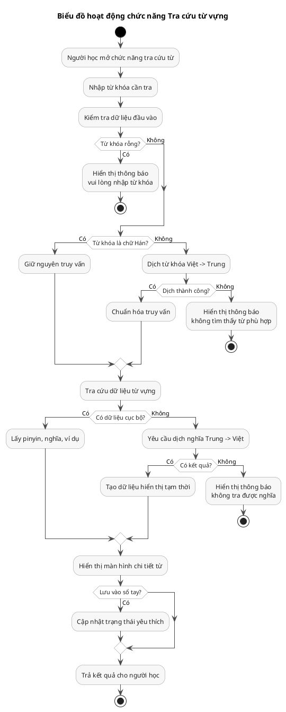
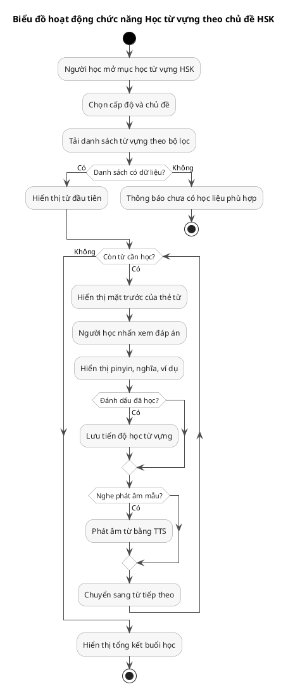
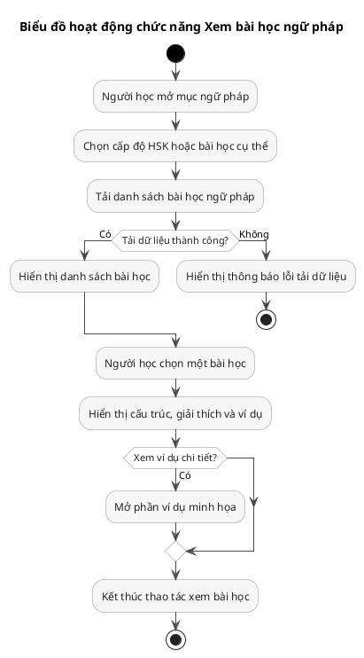
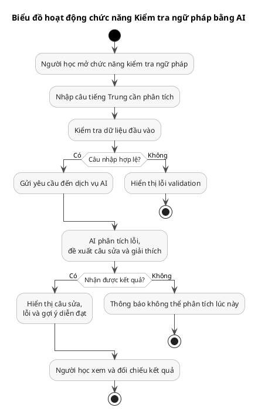
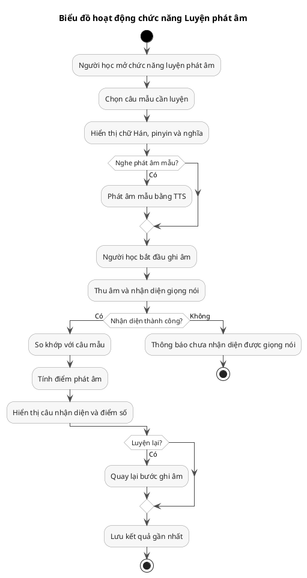
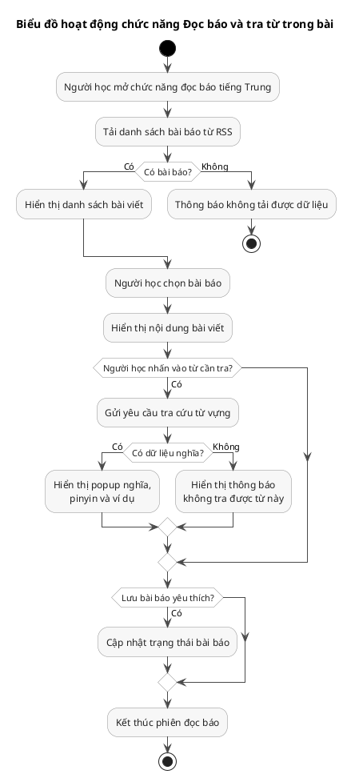
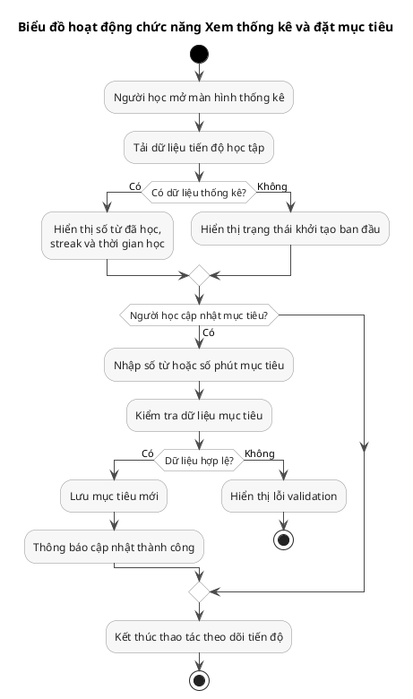
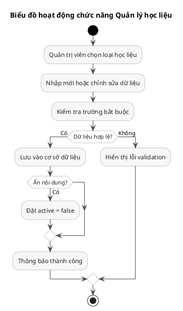

# Toàn bộ code biểu đồ hoạt động

## 1. Tra cứu từ vựng

## 2. Học từ vựng theo chủ đề HSK

## 3. Xem bài học ngữ pháp

## 4. Kiểm tra ngữ pháp bằng AI

## 5. Luyện phát âm

## 6. Đọc báo và tra từ trong bài

## 7. Xem thống kê và đặt mục tiêu

## 8. Quản lý học liệu

